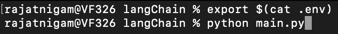

# Generative AI : Develop LLM powered applications with LangChain, Python and Milvus (VectorDB) 

## What is an LLM?
An LLM, which stands for a Language Model, is a type of machine-learning neural network that learns from input/output datasets. These datasets often contain unlabeled or uncategorized text, and the model utilizes self-supervised or semi-supervised learning methods. The LLM takes in information or content and generates predictions for the next word. The input data can range from proprietary corporate data to any information found on the internet, as exemplified by ChatGPT.

Training LLMs effectively requires the use of extensive and expensive server farms that function as supercomputers.

LLMs are governed by a vast number of parameters, reaching into the millions, billions, or even trillions. These parameters serve as decision-making elements, enabling the LLM to choose between various potential answers. For instance, OpenAI's GPT-3 LLM has 175 billion parameters, and their latest model, GPT-4, reportedly boasts 1 trillion parameters.

## What is LangChain?
LangChain is a framework designed to create language model-powered applications. It offers two key features:

1. Data-aware capability, enabling the language model to connect with other data sources.
2. Agentic functionality, allowing the language model to interact with its surroundings effectively.

The main advantages of LangChain include:

1. Components that provide abstractions for language models, offering a range of implementations for each abstraction. These components are modular and user-friendly, whether you choose to use the entire LangChain framework or not.

2. Off-the-shelf chains, which are pre-structured sets of components designed to perform specific higher-level tasks. These ready-made chains facilitate a quick start.

3. For more advanced applications and specific use-cases, the components make it simple to customize existing chains or construct new ones.

## Problem Statement
```
  given information ${DYNAMIC_INPUTS} about a mutual funds from I want you to create:
  1. a short summary
  2. two interesting facts about them  
  3. Which of them is a better option
```

## TechStack
- [Python@3.11] (https://www.python.org/)
- [LangChain Framework] (https://python.langchain.com/)
- [Milvus] (https://milvus.io/)
- [OpenApi Keys] (https://openai.com/blog/openai-api)

## Code Base Setup
```
- mkdir workspace/langChain
- cd workspace/langChain
- virtualenv venv
- alias python=$HOME/workspace/langChain/venv/bin/python3.11
- alias pip=$HOME/workspace/langChain/venv/bin/pip3.11
- pip install --user pipenv
- python -m pip install --upgrade pip
- PYTHON_BIN_PATH="$PWD/venv/bin"
- PATH="$PATH:$PYTHON_BIN_PATH"
- export LANG="en_US.UTF-8"
- pipenv install langchain
- pipenv install black (Formatter)
```


<script src="https://gist.github.com/rajat965ng/4ccd84010ceb5d7f12382e7dcec7302c.js"></script>

This code sets up a language model-powered application to generate summaries of provided information. It uses the GPT-3.5 Turbo model from OpenAI. The code defines a template for the prompt, takes user input data ("information"), initializes the language model (llm), and then creates a Language Model Chain (LLMChain) with the specified llm and prompt. Finally, it executes the chain to generate a summary based on the provided "information" and prints the result.

## Execute 


## Output


## Conclusion
- We have successfully developed a working backend logic using LangChain framework along with OpenAI and Python as a preferred programming language

## References
